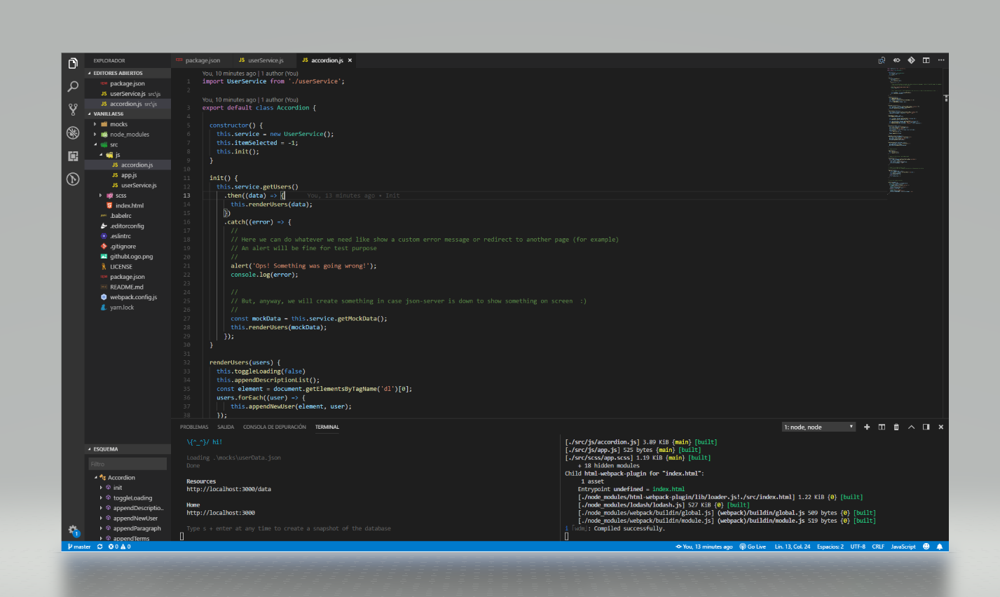

# Exercise

 
 
 
 
 
 
 


Accordion exercise done with ES6-Webpack-JsonServer

## Requeriments
You need to have install it, as global, the next libraries:

```sh
$ npm install -g json-server            # for mock API calls

```

## To execute it in a local environment

You will need to execute webpack and json-server both at same time (*). 




In the 1st terminal window, run the json-server command:
```sh
json-server mocks\userData.json
```
In the 2nd terminal window, run webpack-dev-server with hot reloading:

```sh
npm run start
```
or 

```sh
yarn start
```

(*) Anyway, if the API throw an error, a mock data will be used to display results

## To generate the distribution package
You will need to launch the build process and deploy it the results located in the "dist" folder.

```sh
yarn build
```


## Commands

```sh
$ npm run build               # generates bundler
$ npm run start               # starts local server with hot reloading

```

## Github repository


<a href="https://github.com/ibanjb/VanillaES6">Navigate to the Github repository with the source code</a>

